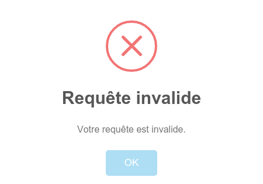
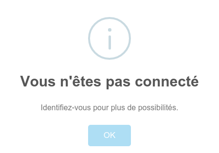
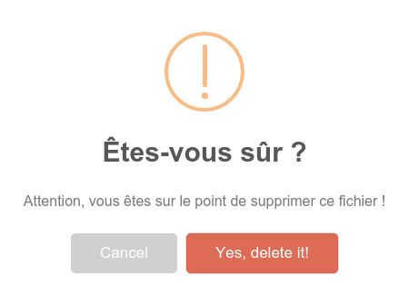

# meteor-alert-i18n
Display an adapted SweetAlert for i18n translations.
``` console
meteor add smaltcreation:paypal-rest-api
```

## Usage
### Basic
The package will display `client side` a [SweetAlert](http://t4t5.github.io/sweetalert/) with translated messages according to your locale and type. Mine is `fr_FR`.
``` javascript
  Alert.open('error.bad-request')
```
In your i18n JSON file like `i18n/fr.i18n.json`:
``` json
  error": {
    "bad-request": {
      "title": "Requête invalide",
      "text": "Votre requête est invalide."
    }
  }
```


**Some translations are already provided in the package, but you can make your own translations in your project. It will also override the provided translations if you set the same key.**

#### Error object
``` javascript
  try {
    throw Meteor.Error('bad-request')
  } catch (e) {
    Alert.open(e);
  }
```
The same alert than the previous example will be displayed.

### Types of translations
Package's translations are divided in 4 parts standing for a `type` of the SweetAlert.
It's an **optional** normalization. But if you do, `type` will be automatically set to SweetAlert.
``` javascript
  Alert.open('info.not-connected');
```
``` json
"info": {
    "not-connected": {
      "title": "Vous n'êtes pas connecté",
      "text": "Identifiez-vous pour plus de possibilités."
    }
  },
```


In this case, `info` has been automatically detected.

### No keys, just messages
You can also use this package for display untranslated messages.
``` javascript
  Alert.open('Surprise!');
```

### Options
[SweetAlert](http://t4t5.github.io/sweetalert/) provide a bunch of options that you can use in the package. See their [documentation](http://t4t5.github.io/sweetalert/).
``` javascript
  Alert.open('warning.delete-file', {
      showCancelButton: true,
      confirmButtonColor: "#DD6B55",
      confirmButtonText: "Yes, delete it!",
      closeOnConfirm: false
  });
```


## Contributing
**Contributions are highly encouraged for pushing this package to a next level of translations.**
Don't hesitate to pull-request your own language file or aditionnal keys for already existing translations.
